# JCL-Gruppen — Technische Navigationskarte

> Automatisch aus `index.html` und `app.js` analysiert.  
> Keine Änderungen am Produktivcode vorgenommen.

---

## 1. Allgemeine Seitenstruktur

```
sportStartScreen        → Startseite / Sportauswahl
loginScreen             → Login (Trainer / Admin / Buchhaltung)
mainScreen + appBox     → Arbeitsbereich nach Login
superAdminLoginModal    → Super Admin Zugang (versteckter Trigger)
superAdminScreen        → Super Admin Dashboard
saStandalonePage        → SA Login über ?superadmin=1 URL-Parameter
```

### Rollen

| Rolle | Home-Screen | `currentTrainer.role` |
|---|---|---|
| Trainer | `groupScreen` | `"Trainer"` |
| Admin | `adminScreen` | `"Admin"` |
| Buchhaltung | `buchhaltungScreen` | `"Buchhaltung"` |
| Super Admin | `superAdminScreen` | eigenes Auth-System |

---

## 2. Alle Screens / Screen-IDs

| Screen-ID | Beschreibung |
|---|---|
| `sportStartScreen` | Startseite, Sportartenauswahl |
| `loginScreen` | Login-Formular (Trainer-Select + PIN) |
| `mainScreen` | Container nach Login (Top-Nav + Rollen-Screens) |
| `groupScreen` | Trainer-Home: Gruppenauswahl, Anwesenheit, Wiegung |
| `attendanceScreen` | Anwesenheitsliste der Gruppe |
| `weightScreen` | Wiegung-Screen |
| `addStudentScreen` | Neuen Schüler hinzufügen |
| `studentStatsScreen` | Schüler-Statistik (Einzelstatistik) |
| `adminScreen` | Admin-Dashboard (Kartengitter) |
| `adminStudentScreen` | Admin Schülerliste + Filter |
| `orphanStudentsScreen` | Schüler ohne Gruppe / ohne Trainer |
| `clubStatistikScreen` | Club Statistik Dashboard |
| `adminStatistikScreen` | Anwesenheit-Statistik (nach Datum/Gruppe/Trainer) |
| `clubStudentStatsScreen` | Schüler-Statistik nach Alter/Gürtel/Geschlecht |
| `zeitraumStatistikScreen` | Zeitraum-Statistik (Clubentwicklung über Zeit) |
| `trainerAdminScreen` | Trainer Übersicht + Statistik |
| `addTrainerScreen` | Neuen Trainer / Admin / Buch hinzufügen |
| `editTrainerScreen` | Trainer bearbeiten |
| `groupOverviewScreen` | Gruppen Übersicht |
| `addGroupScreen` | Neue Gruppe hinzufügen |
| `editGroupScreen` | Gruppe bearbeiten |
| `adminBuchhaltungScreen` | Administrator & Buchhaltung verwalten |
| `sportManagementScreen` | Sportarten verwalten / aktivieren |
| `sponsorManagementScreen` | Werbung / Sponsoren / Popup-Bilder |
| `deleteCandidatesScreen` | Kandidaten zur Löschung (Archiv-Cleanup) |
| `buchhaltungScreen` | Buchhaltung-Dashboard |
| `superAdminScreen` | Super Admin Control Center |
| `saClubsScreen` | SA: Clubs Übersicht |
| `saNewClubScreen` | SA: Neuer Club |
| `saEditClubScreen` | SA: Club bearbeiten |
| `saTarifScreen` | SA: Tarifpakete / Preise |
| `saTarifFormScreen` | SA: Tarif erstellen / bearbeiten |
| `saZahlungenScreen` | SA: Zahlungen / Abonnements |
| `saZahlungFormScreen` | SA: Zahlung erfassen |

---

## 3. Navigationsbäume nach Rolle

### 3.1 Trainer

```
Login (Trainer)
└── groupScreen  [Trainer-Home]
    ├── attendanceScreen          ← showPromoTransition(openSelectedGroupList)
    │   ├── addStudentScreen      ← showPromoTransition(openAddStudentForm)
    │   │   └── [Speichern / Abbrechen] → attendanceScreen
    │   ├── weightScreen          ← showPromoTransition(showWeight)
    │   │   └── [Zurück]         → attendanceScreen
    │   ├── editStudentForm       ← navigateWithPromo(()=>editStudent(...))
    │   │   └── [Speichern / Abbrechen] → attendanceScreen
    │   ├── studentStatsScreen    ← navigateWithPromo(()=>showStudentStats(...))
    │   │   └── [Zurück]         → attendanceScreen
    │   └── [Zurück]             → groupScreen
    ├── weightScreen              ← showPromoTransition(showWeight)
    │   └── [Zurück]             → groupScreen
    ├── [Schüler Statistik Filter im groupScreen]
    │   ├── editStudentForm       ← navigateWithPromo(()=>editStudent(...))
    │   └── studentStatsScreen    ← navigateWithPromo(()=>showStudentStats(...))
    ├── [Home]                   → groupScreen  (goRoleHome)
    └── [Logout]                 → sportStartScreen  (goHome)
```

---

### 3.2 Admin

```
Login (Admin)
└── adminScreen  [Admin-Dashboard]
    ├── adminStudentScreen        ← showPromoTransition(showAdminStudentScreen)
    │   ├── orphanStudentsScreen  ← navigateWithPromo(showOrphanStudentsList)
    │   │   ├── editStudentForm   ← navigateWithPromo(()=>editStudent(...))
    │   │   ├── studentStatsScreen← navigateWithPromo(()=>showStudentStats(...))
    │   │   └── [Zurück]        → adminStudentScreen
    │   ├── editStudentForm       ← navigateWithPromo(()=>editStudent(...))
    │   │   └── [Abbrechen]     → adminStudentScreen
    │   ├── studentStatsScreen    ← navigateWithPromo(()=>showStudentStats(...))
    │   │   └── [Zurück]        → adminStudentScreen
    │   └── [Zurück]            → adminScreen
    │
    ├── clubStatistikScreen       ← showPromoTransition(showClubStatistikScreen)
    │   ├── trainerAdminScreen    ← showPromoTransition(openTrainerStatistikFromClub)
    │   │   ├── editTrainerScreen ← navigateWithPromo(openEditSelectedTrainer)
    │   │   │   └── [Abbrechen] → trainerAdminScreen
    │   │   └── [Zurück]        → clubStatistikScreen
    │   ├── groupOverviewScreen   ← showPromoTransition(showGroupOverviewScreen)
    │   │   ├── editGroupScreen   ← [Bearbeiten-Button in Gruppe]
    │   │   │   └── [Abbrechen] → groupOverviewScreen
    │   │   └── [Zurück]        → clubStatistikScreen
    │   ├── clubStudentStatsScreen← showPromoTransition(openClubStudentStatsFromClub)
    │   │   ├── editStudentForm   ← navigateWithPromo(()=>editStudent(...))
    │   │   ├── studentStatsScreen← navigateWithPromo(()=>showStudentStats(...))
    │   │   └── [Zurück]        → clubStatistikScreen
    │   ├── adminStatistikScreen  ← showPromoTransition(showAdminStatistikCenter)
    │   │   └── [Zurück]        → clubStatistikScreen
    │   ├── zeitraumStatistikScreen← navigateWithPromo(showZeitraumStatistikScreen)
    │   │   └── [Zurück]        → clubStatistikScreen
    │   └── [Zurück]            → adminScreen
    │
    ├── addGroupScreen            ← showPromoTransition(showAddGroup)
    │   └── [Speichern / Zurück]→ adminScreen
    │
    ├── trainerAdminScreen        ← showPromoTransition(openTrainerStatistikFromAdmin)
    │   ├── editTrainerScreen     ← navigateWithPromo(openEditSelectedTrainer)
    │   │   └── [Abbrechen]     → trainerAdminScreen
    │   └── [Zurück]            → adminScreen
    │
    ├── addTrainerScreen          ← showPromoTransition(showAddTrainer)
    │   └── [Speichern / Zurück]→ adminScreen
    │
    ├── adminBuchhaltungScreen    ← showPromoTransition(showAdminBuchhaltungScreen)
    │   ├── [Neuer Admin/Buch]   ← navigateWithPromo(showAddAdminBuchForm)
    │   ├── editTrainerScreen     ← [Bearbeiten-Button]
    │   │   └── [Abbrechen]     → adminBuchhaltungScreen
    │   └── [Zurück]            → adminScreen
    │
    ├── sportManagementScreen     ← showPromoTransition(showSportManagementScreen)
    │   └── [Zurück]            → adminScreen
    │
    ├── sponsorManagementScreen   ← showPromoTransition(showSponsorManagementScreen)
    │   └── [Zurück]            → adminScreen
    │
    ├── deleteCandidatesScreen    ← showPromoTransition(showDeleteCandidatesScreen)
    │   └── [Zurück]            → adminScreen
    │
    ├── [Home]                  → adminScreen  (goRoleHome)
    └── [Logout]                → sportStartScreen  (goHome)
```

---

### 3.3 Buchhaltung

```
Login (Buchhaltung)
└── buchhaltungScreen  [Buchhaltung-Home]
    ├── [Neue Schüler ohne Vertrag]   — Tabelle mit confirmBuchhaltungContract()
    ├── [Inaktive / archivierte Schüler] — Tabelle mit confirmBuchhaltungArchived()
    ├── [Aktive Schüler mit Vertrag]  — Tabelle (Anzeige)
    ├── studentStatsScreen             ← navigateWithPromo(()=>showStudentStats(...))
    │   └── [Zurück]                 → buchhaltungScreen
    ├── [Home]                        → buchhaltungScreen  (goRoleHome)
    └── [Logout]                      → sportStartScreen  (goHome)
```

---

### 3.4 Super Admin

```
superAdminLoginModal  [SA Login]
└── superAdminScreen  [SA Control Center]
    ├── saClubsScreen               ← navigateWithPromo(showSAClubsScreen)
    │   ├── saNewClubScreen         ← navigateWithPromo(showSANewClubScreen)
    │   │   └── [Speichern / Zurück]→ saClubsScreen
    │   ├── saEditClubScreen        ← [Bearbeiten-Button pro Club]
    │   │   └── [Speichern / Zurück]→ saClubsScreen
    │   ├── [Club öffnen]           → Impersonation → clubView (appBox)
    │   │   └── [← Zurück zum SA]  → superAdminScreen  (saExitImpersonation + promo)
    │   └── [Zurück]               → superAdminScreen  (hideSAClubsScreen + promo)
    │
    ├── saTarifScreen               ← navigateWithPromo(showSATarifScreen)
    │   ├── saTarifFormScreen       ← navigateWithPromo(showSATarifFormNew)
    │   │   └── [Speichern / Zurück]→ saTarifScreen
    │   └── [Zurück]               → superAdminScreen  (hideSATarifScreen + promo)
    │
    ├── saZahlungenScreen           ← navigateWithPromo(showSAZahlungenScreen)
    │   ├── saZahlungFormScreen     ← [Zahlung erfassen-Button pro Club]
    │   │   └── [Speichern / Zurück]→ saZahlungenScreen
    │   └── [Zurück]               → superAdminScreen  (hideSAZahlungenScreen + promo)
    │
    └── [Logout]                   → superAdminLoginModal  (superAdminLogout)
```

---

## 4. Alle `currentView`-Werte

| Wert | Beschreibung |
|---|---|
| `'buchhaltung'` | Buchhaltung-Home |
| `'adminStudents'` | Admin Schülerliste |
| `'adminBuchhaltung'` | Admin & Buchhaltung |
| `'clubStatistik'` | Club Statistik |
| `'sportManagement'` | Sport Management |
| `'sponsorManagement'` | Sponsor / Werbung |
| `'deleteCandidates'` | Löschkandidaten |
| `'orphanStudents'` | Schüler ohne Gruppe |
| `'studentStats'` | Schüler-Einzelstatistik |
| `'clubStudentStats'` | Club Schüler-Statistik |
| `'groupOverview'` | Gruppen Übersicht |
| `'editGroup'` | Gruppe bearbeiten |
| `'addGroup'` | Gruppe hinzufügen |
| `'trainerAdminFromClub'` | Trainer-Admin (aus Club Statistik) |
| `'trainerAdmin'` | Trainer-Admin (aus Admin Dashboard) |
| `'addTrainer'` | Trainer hinzufügen |
| `'editTrainer'` | Trainer bearbeiten |
| `'adminStatistikCenter'` | Anwesenheit-Statistik |
| `'zeitraumStatistik'` | Zeitraum-Statistik |

---

## 5. Mermaid-Diagramm

```mermaid
flowchart TD
    Start([Startseite / Sportauswahl]) --> Login[Login]
    Start --> SALogin[Super Admin Login]

    Login --> Trainer[Trainer-Home\nGroupScreen]
    Login --> Admin[Admin-Dashboard\nAdminScreen]
    Login --> Buch[Buchhaltung-Home\nBuchhaltungScreen]

    %% TRAINER
    Trainer --> Anw[Anwesenheit\nAttendanceScreen]
    Trainer --> Wig[Wiegung\nWeightScreen]
    Anw --> AddS[Schüler hinzufügen\nAddStudentScreen]
    Anw --> Wig
    Anw --> EditS1[Schüler bearbeiten]
    Anw --> Stats1[Schüler Statistik\nStudentStatsScreen]

    %% ADMIN
    Admin --> Schueler[Schülerliste\nAdminStudentScreen]
    Admin --> ClubStat[Club Statistik\nClubStatistikScreen]
    Admin --> NeueGruppe[Neue Gruppe\nAddGroupScreen]
    Admin --> TrainerStat1[Trainer Statistik\nTrainerAdminScreen]
    Admin --> NeuerTrainer[Neuer Trainer\nAddTrainerScreen]
    Admin --> AB[Admin & Buchhaltung\nAdminBuchhaltungScreen]
    Admin --> Sport[Sport Management\nSportManagementScreen]
    Admin --> Sponsor[Werbung / Sponsoren\nSponsorManagementScreen]
    Admin --> Loeschkand[Löschkandidaten\nDeleteCandidatesScreen]

    Schueler --> Orphan[Ohne Gruppe/Trainer\nOrphanStudentsScreen]
    Schueler --> EditS2[Schüler bearbeiten]
    Schueler --> Stats2[Schüler Statistik]

    ClubStat --> TrainerStat2[Trainer Statistik]
    ClubStat --> GruppenUeb[Gruppen Übersicht\nGroupOverviewScreen]
    ClubStat --> ClubStudStat[Schüler Statistik\nClubStudentStatsScreen]
    ClubStat --> AnwStat[Anwesenheit Statistik\nAdminStatistikScreen]
    ClubStat --> ZeitStat[Zeitraum Statistik\nZeitraumStatistikScreen]

    GruppenUeb --> EditGruppe[Gruppe bearbeiten\nEditGroupScreen]
    TrainerStat2 --> EditTrainer2[Trainer bearbeiten\nEditTrainerScreen]
    TrainerStat1 --> EditTrainer1[Trainer bearbeiten]
    AB --> EditTrainer3[Trainer bearbeiten]
    AB --> NeuerBuch[Neuer Admin/Buch]

    %% BUCHHALTUNG
    Buch --> OhneVertrag[Neue Schüler ohne Vertrag]
    Buch --> Archiv[Inaktive / archivierte Schüler]
    Buch --> MitVertrag[Aktive Schüler mit Vertrag]
    Buch --> Stats3[Schüler Statistik]

    %% SUPER ADMIN
    SALogin --> SADash[Super Admin Dashboard\nSuperAdminScreen]
    SADash --> SAClubs[Clubs Übersicht\nSAClubsScreen]
    SADash --> SATarif[Tarifpakete\nSATarifScreen]
    SADash --> SAZahl[Zahlungen\nSAZahlungenScreen]

    SAClubs --> SANewClub[Neuer Club\nSANewClubScreen]
    SAClubs --> SAEditClub[Club bearbeiten\nSAEditClubScreen]
    SAClubs --> SAImp[Club öffnen\nImpersonation-Modus]
    SAImp --> |Zurück zum SA| SADash

    SATarif --> SATarifForm[Tarif erstellen/bearbeiten\nSATarifFormScreen]
    SAZahl --> SAZahlForm[Zahlung erfassen\nSAZahlungFormScreen]
```



---

## 6. Technische Details

### Promo Transition

Alle Hauptnavigationen laufen über:
```js
showPromoTransition(callback)   // direkter Aufruf
navigateWithPromo(callback)     // Wrapper-Funktion (universal)
```

Ausnahmen (KEIN Promo): Logout (`goHome`), Filter/Select, X-Buttons modaler Dialoge.

### Screen-Visibility-Pattern

```js
hideAllWorkScreens();
document.getElementById('targetScreen').classList.remove('hidden');
currentView = 'targetView';
```

### Back-Navigation

```js
goBack()           // universeller Zurück-Handler mit previousView/currentView Logik
goRoleHome()       // zurück zur Rollen-Home (über showPromoTransition)
cancelStudentEditForm()    // Schüler-Formular abbrechen (über showPromoTransition)
backToGroupOverview()      // Gruppe-Formular abbrechen (über showPromoTransition)
backToTrainerStatistik()   // Trainer-Formular abbrechen (über showPromoTransition)
```

---

## 7. Offene Punkte / zu prüfen

| # | Punkt | Status |
|---|---|---|
| 1 | `showSAEditClubScreen(clubId)` — wird per SA-Karten-Button in `saClubsScreen` aufgerufen; muss geprüft werden ob navigateWithPromo dort fehlt | ⚠ offen |
| 2 | `showSAZahlungForm(clubId)` — wird per Button in `saZahlungenScreen` aufgerufen; gleiches Problem | ⚠ offen |
| 3 | Impersonation-Modus: nach `saExitImpersonation()` → promo ✓ aber beim *Eintreten* in Club (SA-Klick auf „Öffnen") unklar ob promo | ⚠ offen |
| 4 | `weightScreen` — previousScreenBeforeWeight richtig gesetzt? Bei mehrfachem Wiegung-Aufruf könnte Stack leer sein | ⚠ offen |
| 5 | `editStudentForm` — kein eigener Screen-ID-Wrapper, öffnet inline im DOM; goBack() greift über `previousScreenBeforeEditStudent` | ℹ Info |
| 6 | Buchhaltung: confirm-Buttons (`confirmBuchhaltungContract`, `confirmBuchhaltungArchived`) lösen keinen Screen-Wechsel aus, nur DB-Update + Reload | ℹ Info (korrekt) |
